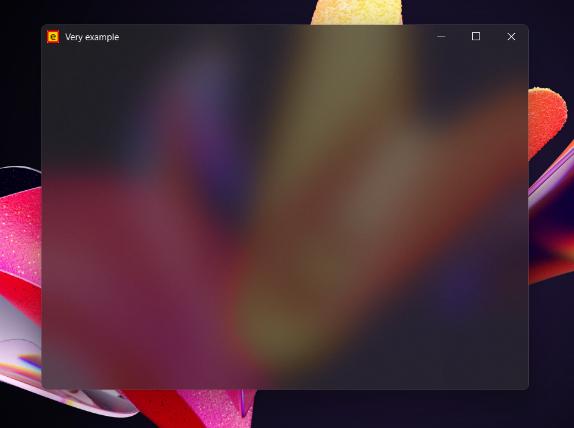
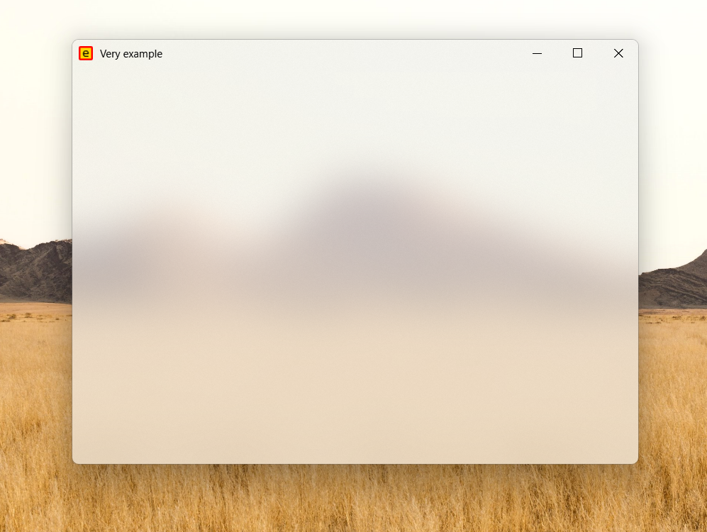

# Custom window
### Description
Frameless window and base with multiple effects working on PyQt6/PySide6 for Windows 11/10.

## Features:
+ Win 11 Snap Layouts
+ Acrylic and Mica effects
+ Properly working moving and stretching, thanks to the temporary deactivation of the acrylic effect
+ Title and icon in titlebar
+ System dark mode
+ Changeable background color, which adapts to dark mode
+ Animated
### Usage
Just inherit `CustomWindow` or `CustomBase` with parameters. Look [example.py](example.py)
### Screenshots

### Requirements
Look [requirements.txt](requirements.txt) (install only PyQt or only PySide)
### Reference
This is a rewritten and lightened version of <a href="https://github.com/zhiyiYo/PyQt-Frameless-Window">PyQt-Frameless-Window</a> project.
### License
Look [LICENSE](LICENSE)